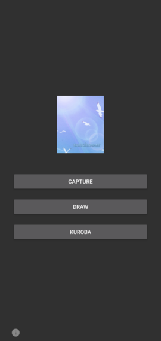
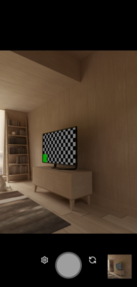
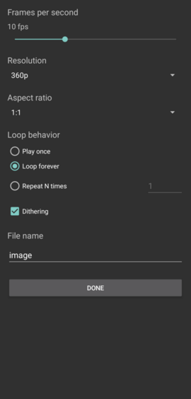
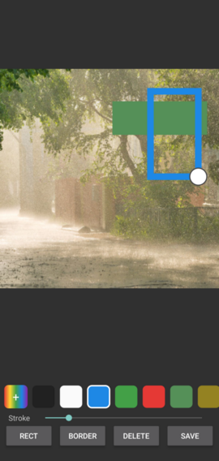
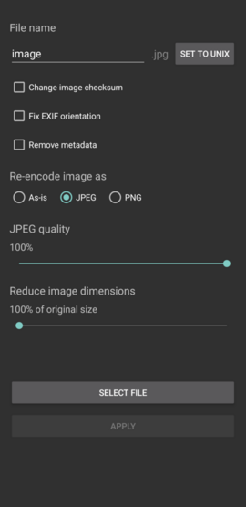

Sunshower is a light image editor that allows you to,

- Take animated GIFs directly from your phone camera.
    - GIF capture supports various settings such as dither, frames per second, animation loop count, resolution, and filenaming.
- Draw on images and GIFs with a full color picker and recently used colors.
- Overlay rectangles and boxes of any color.
- Apply Kuroba metadata edits.

Supported formats: GIF, PNG, JPEG, and static WebP.

See if its what you're looking for, here are some screenshots.

