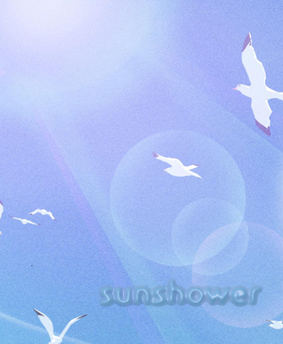
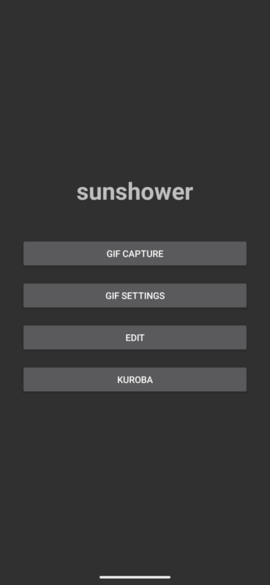
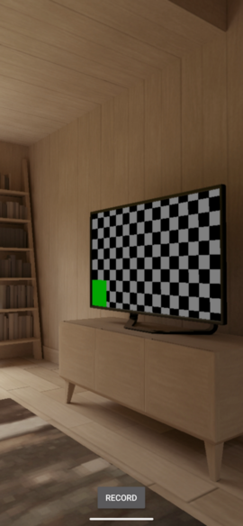
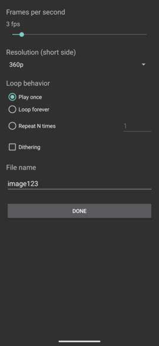
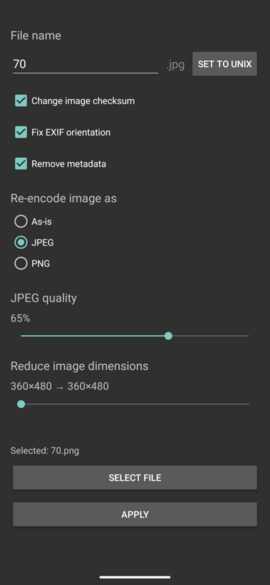

Sunshower is a light image editor that allows you to,

- Take animated GIFs directly from your phone camera
    - GIF capture supports various settings such as dither, frames per second, animation loop count, resolution and naming.
- Overlay rectangles and boxes
- Apply Kuroba metadata edits

Supported image formats are gif, png, jpg, webp (static).

See if its what you're looking for, here are some screenshots.

